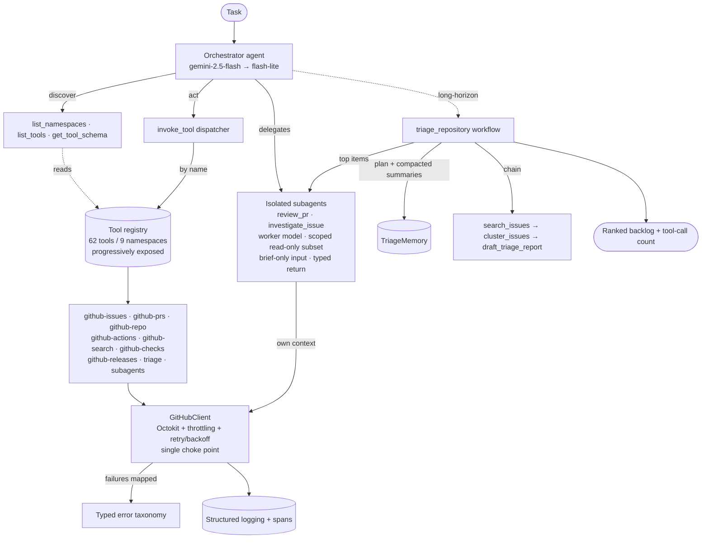

<p align="left">
  
</p>

# Reeve

Reeve is a production-shaped autonomous agent that maintains a GitHub repository the way a senior maintainer would — built on [Mastra](https://mastra.ai) + Google Gemini, it interprets a task, **discovers and selects its own tools by description** (62 tools across 9 namespaces, progressively exposed), **delegates isolated subtasks to scoped read-only subagents**, and runs **long-horizon jobs** (the `triage_repository` task crossed **27 tool calls** in one live session) without losing its plan — all behind production scaffolding: a single throttled/retrying GitHub client, a typed error taxonomy, structured spans, and an eval harness with unit + integration tests.

## Quickstart

```bash
# 1. Install (Node 20+, pnpm)
pnpm install

# 2. Configure — copy and fill in
cp .env.example .env
#   GITHUB_TOKEN                  fine-grained PAT for the sandbox repo
#   GOOGLE_GENERATIVE_AI_API_KEY  Google Generative AI key (Mastra model router)
#   GITHUB_SANDBOX_REPO           owner/repo Reeve operates on

# 3. Verify (no network / no model needed)
pnpm typecheck && pnpm test       # unit + integration suites
pnpm eval --mock                  # eval harness, fully offline

# 4. Live demos (need the env above; use Gemini free-tier quota)
pnpm tsx scripts/smoke.ts         # one orchestrated task end-to-end
pnpm tsx scripts/triage-demo.ts   # flagship long-horizon triage (20+ tool calls)
pnpm eval                         # eval with the live LLM judge
```

> Free-tier note: `gemini-2.5-flash-lite` is capped at **20 requests/day**. One
> full triage run can exhaust it; runs fail fast on a 429 rather than retry. Move
> the model in `src/config/models.ts` to a higher tier for sustained use.

## Architecture



- **Stack:** TypeScript (strict) + Mastra + Node 20+ + pnpm.
- **Models:** Google Gemini via Mastra's model router. Orchestrator + long-horizon
  task use a fallback chain `gemini-2.5-flash → gemini-2.5-flash-lite` with
  per-model retries; subagents and the eval judge use `gemini-2.5-flash-lite`.
  Provider-swappable by design (`src/config/models.ts`).
- **Namespaces:** `github-issues`, `github-prs`, `github-repo`, `github-actions`,
  `github-search`, `github-checks`, `github-releases`, `triage`, `subagents`.
- **Flagship long-horizon task:** `triage_repository` — paginates all open issues,
  clusters and prioritises them, investigates top items via the isolated subagent,
  drafts responses, emits a ranked backlog; 20+ tool calls with the plan persisted
  and intermediate batches compacted.
- **Composable chain:** `search_issues → cluster_issues → draft_triage_report`.

## Required properties → where they live

| Property | Code | Proven by |
| --- | --- | --- |
| 50+ tools, ≥4 namespaces, model-selected, progressively exposed | `src/tools/registry.ts`, `src/tools/exposure.ts` (62 tools / 9 ns) | `tests/unit/tools.registry.test.ts`, `tests/unit/tools.handlers.test.ts`; live `artifacts/smoke.txt` |
| ≥1 truly isolated subagent, scoped tools, typed return | `src/agents/subagents/runner.ts`, `review-pr.ts`, `investigate-issue.ts` | `tests/unit/subagents.isolation.test.ts`; live investigations in `artifacts/triage-demo.txt` |
| Single session crosses 20 tool calls, plan intact | `src/workflows/triage-repository.ts`, `triage-memory.ts` | `tests/unit/triage-repository.test.ts`; **live 27 calls** `artifacts/triage-demo.txt` |
| Observability, retries+backoff, rate limiting, typed errors, eval, unit+integration tests | `src/github/client.ts`, `src/observability/`, `src/errors/`, `src/eval/` | `tests/integration/github.resilience.test.ts`, `tests/unit/model-fallback.test.ts`, `tests/unit/eval.test.ts`, `artifacts/eval-mock.txt` |
| ≥1 composed tool chain | `src/workflows/triage-chain.ts` | `tests/unit/chain.schemas.test.ts`, `tests/integration/triage-chain.test.ts` |

See [`CLAUDE.md`](./CLAUDE.md) for the full engineering charter and invariants,
and [`DECISIONS.md`](./DECISIONS.md) for autonomous decisions and their rationale.

## Layout

```
src/
  config/         # zod-validated env + shared Mastra model config (fallback chain)
  github/         # Octokit wrapper: throttling + retry, the single GitHub choke point
  errors/         # typed error taxonomy + Octokit → taxonomy mapping
  observability/  # pino structured logger with operation context
  tools/          # GitHub tool registry              (step 3+)
  agents/         # orchestrator + isolated subagents  (step 4+)
  workflows/      # composable chains + triage_repository (step 5+)
  eval/           # scored evaluation harness          (step 6+)
tests/
  unit/           # hermetic; msw blocks all network
  integration/    # real client + plugins, GitHub simulated by msw
  msw/ · setup/   # shared msw server + per-project setup
```

## Getting started

```bash
pnpm install
cp .env.example .env   # then fill in GITHUB_TOKEN, GOOGLE_GENERATIVE_AI_API_KEY, GITHUB_SANDBOX_REPO
```

Required environment (validated at startup — missing values fail fast):

| Variable | Purpose |
| --- | --- |
| `GITHUB_TOKEN` | GitHub PAT for all API calls |
| `GOOGLE_GENERATIVE_AI_API_KEY` | Google key read by Mastra's model router |
| `GITHUB_SANDBOX_REPO` | Target repo as `owner/repo` |

## Scripts

| Command | Description |
| --- | --- |
| `pnpm typecheck` | `tsc --noEmit` (strict) |
| `pnpm build` | Emit `dist/` from `src/` |
| `pnpm test` | Run unit + integration suites |
| `pnpm test:unit` / `pnpm test:integration` | Run one project |
| `pnpm dev` | Run the bootstrap entry point |

## Production scaffolding

- **Env config** — zod-validated, fail-fast with an aggregated error.
- **Model config** — Mastra model router with a fallback chain + per-model retries.
- **GitHub client** — Octokit composed with throttling (rate-limit aware) and
  retry (exponential backoff on 5xx/network); every tool calls GitHub only
  through it.
- **Error taxonomy** — `AuthError`, `NotFoundError`, `RateLimitError`,
  `ValidationError`, `UpstreamError`; Octokit failures map in, no untyped throws.
- **Observability** — pino structured logging with bound operation context.
- **Tests** — vitest unit + integration projects; msw guarantees unit tests never
  hit the network.

## Observability — what is traced

Everything logs through one pino-based layer (`src/observability`), which binds an
`operation` (and optional `correlationId`) to every line and redacts tokens/keys.
Each significant unit emits structured **spans** carrying `operation`, the `tool`
name where relevant, `durationMs` latency, and an `outcome` (`success`/`failure`):

| Layer | Span(s) | Key fields |
| --- | --- | --- |
| GitHub client | `github.request.start/success/failure` | `operation`, `durationMs`, mapped `err` |
| Throttle/retry | `Primary/Secondary rate limit hit` | `method`, `url`, `retryAfter`, `retryCount` |
| Orchestrator | `orchestrator.tool_call` | `operation`, `tool`, `durationMs`, `outcome`, `errorCode` |
| Subagents | `subagent.start` / `subagent.done` / `subagent.failed` | `threadId`, `scope`, `durationMs`, `outcome` |
| triage_repository | `triage.tool_call`, `triage.plan_recorded`, `triage.gathered`, `triage.done` | `tool`, `durationMs`, `outcome`, **running `count`** |

The **tool-call count is visible end-to-end**: every tool/subagent call in the
long-horizon task increments a `ToolCallCounter` that logs the running `count` on
each call, and the final result reports `totalToolCalls`. Logs are JSON by
default; set `REEVE_LOG_PRETTY=1` for human-readable output and
`REEVE_LOG_LEVEL=debug` for verbose tracing.

## Evaluation harness

`src/eval` scores triage/investigation quality against fixtures mirroring the
seeded sandbox. The scorer has two modes: **deterministic** checks (exact /
contains / ordering on structured outcomes) and an **LLM judge** for fuzzy
criteria. The judge is the *only* place the harness touches a live model and is
isolated behind one function, so it is fully mockable.

```bash
pnpm eval          # default: live judge (google/gemini-2.5-flash-lite)
pnpm eval --mock   # fully offline: stubbed judge, deterministic checks run for real
```

Live runs fail fast on a Gemini 429 (no retry loop).

## Deployment readiness

The codebase is structured for deployment, not just demo:

- **Typed, fail-fast config** — all secrets/settings load through one zod-validated
  `loadEnv()` (`src/config/env.ts`); a missing var aborts at boot, not mid-run.
- **Single GitHub choke point** — every external call goes through one
  throttled + retrying `GitHubClient` (`src/github/client.ts`), so rate limiting,
  exponential backoff, logging, and typed-error mapping are guaranteed, not per-call.
- **Structured logs + spans** — JSON logging with operation/tool/latency/outcome
  and token redaction (`src/observability`), ready to ship to any log sink.
- **Stateless tools** — each tool is a pure typed input→output handler over the
  shared client; nothing holds process-local state, so the service scales
  horizontally.
- **Model-router fallback** — the orchestrator degrades flash → flash-lite on
  429/5xx, absorbing transient upstream failures.

**How it would deploy** (not done here): package `src/` as a container image (or a
serverless function) with config supplied entirely via environment variables; the
GitHub PAT and model key are injected as secrets. To take it off the free tier,
swap the runtime model to a higher-tier/paid key in **one line** in
`src/config/models.ts` (the model router makes the provider/model
provider-swappable). No code changes are required to point Reeve at a different
repository — only `GITHUB_SANDBOX_REPO`.
